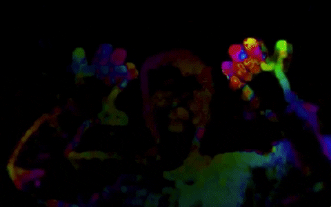

# OpenCV_Projects

This repository includes any projects that I have completed with research, projects, or online classes. My main focus is to study fields that cross over Machine Learning (Convolutionary Neural Network, Support Vector Machines, and Clustering of K-means), Computer Vision and Data Science. 

# Contents:
1. [Basics of Computer Vision and OpenCV](#Basics-of-Computer-Vision-and-OpenCV)
2. [Image Manipulation and Processing](#Image-Manipulation-and-Processing)
3. [Image Segmentation and Contours](#Image-Segmentation-and-Contours)
4. [Object Detection Part 1: Intro](#Object-Detection-Part-1-Intro)
5. [Object Detection Part 2: Build a Face, people and Car Detectors](#Object-Detection-Part-2-Build-a-Face-people-and-Car-Detectors)
6. [Augmented Reality (AR): Facial Landmark Identification](#Augmented-Reality-AR-Facial-Landmark-Identification)
7. [Simple Machine Learning using OpenCV](#Simple-Machine-Learning-using-OpenCV)
8. [Object Tracking and Motion Analysis](#Object-Tracking-and-Motion-Analysis)
9. [Computational Photography](#Computational-Photography)
10. [Self Driving Cars](#Self-Driving-Cars)
11. [Deep Learning](#Deep-Learning)

# Sections: 
### Basics of Computer Vision and OpenCV 
### ([Return back to Contents](#Contents))
Image Processing. Learn some of the basics of image processing such as blurring an image, understanding image morphology, geometric transforms, and image histograms.
 

|                       |        |          |
| :---:                 | :----: |  :----:  |
| [OpenCV Intro](https://github.com/rchavezj/OpenCV_Projects/blob/master/Sec01_Basics_of_CV/01-Reading-Writing-and-displaying-images/01-Reading-Writing-and-displaying-images.ipynb)|        |  Learn how to display a simple image   plt.imshow(cv2.cvtColor(input, cv2.COLOR_BGR2RGB))|
| [Grayscaling](https://github.com/rchavezj/OpenCV_Projects/blob/master/Sec01_Basics_of_CV/02-Grayscaling/02-Grayscaling.ipynb) |  | Grayscaling is a very popular technique in computer vision to find the gradient on edge points of an image. |
| [Colors HSV-Hue](https://github.com/rchavezj/OpenCV_Projects/blob/master/Sec01_Basics_of_CV/03-Colors-HSV-Hue-Saturation-Value/03-Colors-HSV-Hue-Saturation-Value.ipynb)  |        | Now we know how to convert BGR image to HSV, we can use this to extract a colored object. In HSV, it is more easier to represent a color than in BGR color-space. In our application, we will try to extract a blue colored object.|
| [Colors Gray-RGB](https://github.com/rchavezj/OpenCV_Projects/blob/master/Sec01_Basics_of_CV/04-Colors-Gray-RGB/04-Colors-Gray-RGB.ipynb) |        | In OpenCV we can convert an RGB image into Grayscale by two ways: 1.  By using cvtColor function. 2.  By using imread function, where the first parameter specifies the image name while the second parameter specifies the format in which we need to add the image. |
| [Color Red-Green-Blue](https://github.com/rchavezj/OpenCV_Projects/blob/master/Sec01_Basics_of_CV/05-Colors-Red-Green-Blue/05-Colors-Red-Green-Blue.ipynb)          |        |   Computers can only understand three colors: red, green, and blue. This topic helps us tweek the color intensity in RGB.     |
| [Histogram](https://github.com/rchavezj/OpenCV_Projects/blob/master/Sec01_Basics_of_CV/06-Histograms/06-Histograms.ipynb)             |        |   Histogram helps us understaqnd the distribution behind the colors of an image. This is important to know when you plan on compiling a machine learning algorithm with a balanced dataset|
| [Drawings of Shapes](https://github.com/rchavezj/OpenCV_Projects/blob/master/Sec01_Basics_of_CV/07-Drawing-Images/07-Drawing-Images.ipynb)    |   | If you ever need to have shapes to interact with the computer vision world like object detection, it's common to create digital shapes to represent them.  |

### Image Manipulation and Processing
### ([Return back to Contents](#Contents))
In this section we are going to see how we are going to manipulate the image using OpenCV. Here we will learn to apply the following function on an image using OpenCV: (1) Image Transformations – Affine and Non-Affine Transformation (2) Image Translations – Moving image up, down, left and right (3) Rotation of image – Spinning the image (4) Scaling, Resizing, and Interpolation (5) Image Pyramids – Another way of resizing (6) Cropping – Cutting out the image region you want (7) Arithmetic operations for Brightening and Darkening of images

|  |  |   |
| :---:                     | :----: |  :----:  |
| [Transformation](https://github.com/rchavezj/OpenCV_Projects/blob/master/Sec02_Image_Manipulations/00_Transformation/affine_nonAffine.png)            |        |   In this chapter we learn how to transform images for rotation, scaling, bitwise pixel manipulations and edge detection. Before sending a picture or frame into a computer vision model, we need to adjust the features (histogram) in order to change quality. |
| [Img Translation](https://github.com/rchavezj/OpenCV_Projects/blob/master/Sec02_Image_Manipulations/01_Translations/01_Translations.ipynb)           |        |  Img Translation will help you crop your picture to adjust the features within your input. For example if you needed to train an AI to detect a specific object, you would want to crop your main label and avoid pixels irrelevant to what your detecting. |
| [Rotations](https://github.com/rchavezj/OpenCV_Projects/blob/master/Sec02_Image_Manipulations/02_Rotations/02_Rotations.ipynb)                 |        |  Sometimes objects in an a image that need to be trained are not properly positioned correctly to help the AI understand the features we want to aggregate. Usuaing rotations we can help position the object correctly to help train our algorithm. |
| [Scaling](https://github.com/rchavezj/OpenCV_Projects/blob/master/Sec02_Image_Manipulations/03_Scaling_re-sizing_and_interpolations/03_Scaling_re-sizing_and_interpolations.ipynb)   |     | Sometimes zooming into a picture looses pixel quality. With scaling in opencv, we can generate new pixels to prevent blury content with zooming in.|
| [Image Pyramids (Resize)](https://github.com/rchavezj/OpenCV_Projects/blob/master/Sec02_Image_Manipulations/04_Image_Pyramids/04_Image_Pyramids.ipynb)   |        |  Learn how to resize images to for visiual designers|
| [Region of intrest (Crop)](https://github.com/rchavezj/OpenCV_Projects/blob/master/Sec02_Image_Manipulations/05_Cropping/05_Cropping.ipynb)  |        | In self driving cars we need to focus on street lanes in order to teach a car to drive by itself. With region of interest, we can crop out a section of an image and focus on the pixels representing a street (Mode info under section (#Self-Driving-Cars))|
| [Bitwise Operations (Mask)](https://github.com/rchavezj/OpenCV_Projects/blob/master/Sec02_Image_Manipulations/07_Bitwise_Operations_and_Masking/07_Bitwise_Operations_and_Masking.ipynb) |  | After grayscaling an image to detect edges with high gradients, it's neccessary to trigger a bitwise operation and seperate white and black pixels similar to logic gates with 1's and 0's. |
| [Convolutions & Blurring](https://github.com/rchavezj/OpenCV_Projects/blob/master/Sec02_Image_Manipulations/08_Convolutions_and_Blurring/08_Convolutions_and_Blurring.ipynb)  |        |  There will be noise with aggregating pixels so using probability algorithms to generate new pixels like Gaussian will reduce noices and blurry content        |
| [Sharpening](https://github.com/rchavezj/OpenCV_Projects/blob/master/Sec02_Image_Manipulations/09_Sharpening/09_Sharpening.ipynb)  |  | When a picture is blurry we can use interpolation to sharpen images           |
| [Thresholding](https://github.com/rchavezj/OpenCV_Projects/blob/master/Sec02_Image_Manipulations/10_Thresholding_Binarization_%26_Adaptive_Thresholding/10_Thresholding_Binarization_%26_Adaptive_Thresholding.ipynb)  |       | When theres a huge intensity between black and white pixel, we calcualte the thershold in order to find the gradients for edges in an image          |
|  [Dilation & Erosion](https://github.com/rchavezj/OpenCV_Projects/blob/master/Sec02_Image_Manipulations/11_Dilation_Erosion_Opening_and_Closing/11_Dilation_Erosion_Opening_and_Closing.ipynb) |       | The most basic morphological operations are dilation and erosion. Dilation adds pixels to the boundaries of objects in an image, while erosion removes pixels on object boundaries.|
|  [Edge Detection](https://github.com/rchavezj/OpenCV_Projects/blob/master/Sec02_Image_Manipulations/12_Edge_Detection_%26_Image_Gradients/12_Edge_Detection_%26_Image_Gradients.ipynb) |        |  Identifying a variety of mathematical methods that aim at identifying points in a digital image at which the image brightness changes sharply or, more formally, has discontinuities. |
|  [Perspective & Affine Transforms](https://github.com/rchavezj/OpenCV_Projects/blob/master/Sec02_Image_Manipulations/13_Perspective_%26_Affine_Transforms/13_Perspective_%26_Affine_Transforms.ipynb)  |        |  Affine Transform is a function between affine spaces which preserves points, straight lines and planes. |
|  [Live Sketch Using Webcam](https://github.com/rchavezj/OpenCV_Projects/blob/master/Sec02_Image_Manipulations/14_Live_Sketch_Using_Webcam/14_Live_Sketch_Using_Webcam.ipynb)  |        |   A live webcam program converting each frame into grayscaling to compute the gradient to visualize the edges. Afterwards reverse bitwise operation to inverse white and black pixels. |

### Image Segmentation and Contours 
### ([Return back to Contents](#Contents))
Segmenting Images and Obtaining Interesting Points. Apply different algorithms to cluster data, segment images, as well as find and match interesting points in an image.

|                             |        |          |
| :---:                       | :----: |  :----:  |
|  [Segmentation and Contours](https://github.com/rchavezj/OpenCV_Projects/blob/master/Sec03_Image_Segmentation/01_Understanding_Contours/01_Understanding_Contours.ipynb)  |        | Segmentation is the understanding of an image at the pixel level. Assigned an object class for each pixel in the image. After performing object clasification for each object, we also have to delineate the boundaries for them. |
|  [Sorting Contours](https://github.com/rchavezj/OpenCV_Projects/blob/master/Sec03_Image_Segmentation/02_Sorting_Contours/02_Sorting_Contours.ipynb)           |   | With Sorting Contours you can (1) Adjust size/area, along with a template to follow to sort contours by any other arbitrary criteria. (2) Sort contoured regions from left-to-right, right-to-left, top-to-bottom, and bottom-to-top using only a single function. |
|  [Approx. Contours & Convex](https://github.com/rchavezj/OpenCV_Projects/blob/master/Sec03_Image_Segmentation/03_Approximating_Contours_and_Convex_Hull/03_Approximating_Contours_and_Convex_Hull.ipynb)   |   |  Convex hull (sometimes also called the convex envelope) of a set of points X in the Euclidean plane or Euclidean space is the smallest convex set that contains X.     |
|  [Contours & Convex Live Stream](https://github.com/rchavezj/OpenCV_Projects/blob/master/Sec03_Image_Segmentation/03_Approximating_Contours_and_Convex_Hull/03_contours_convex_live_camera.ipynb)       |        | Convex hull (sometimes also called the convex envelope) of a set of points X in the Euclidean plane or Euclidean space is the smallest convex set that contains X.         |
|  [Matching Contour](https://github.com/rchavezj/OpenCV_Projects/blob/master/Sec03_Image_Segmentation/04_Matching_Contours_Shape/04_Matching_Contours_Shape.ipynb)            |        |   A Matching Countour find locations, sizes and orientations of predefined objects in an image. The matcher can be trained to identify and accurately locate objects based on the shape of their boundaries. The contours of objects are detected in a binary image. Hence, it is essential that the objects of interest can be separated from the background.       |
|  [Identify Contour](https://github.com/rchavezj/OpenCV_Projects/blob/master/Sec03_Image_Segmentation/05_Identifying_Contours_by_Shape/05_Identifying_Contours_by_Shape.ipynb)            |        |  The contours are a useful tool for shape analysis and object detection and recognition. |
|  [Line Detection](https://github.com/rchavezj/OpenCV_Projects/blob/master/Sec03_Image_Segmentation/06_Line_Detection_using_Hough_Lines/06_Line_Detection_using_Hough_Lines.ipynb)         |        | The Hough Line Transform is a transform used to detect straight lines. OpenCV implements three kinds of Hough Line Transforms:(Standard Hough Transform, SHT),（Multi-Scale Hough Transform, MSHT）and (Progressive Probabilistic Hough Transform, PPHT). |
|  [Circle Detection](https://github.com/rchavezj/OpenCV_Projects/blob/master/Sec03_Image_Segmentation/07_Circle_Detection_using_Hough_Cirlces/07_Circle_Detection_using_Hough_Cirlces.ipynb)           |        | The Hough Circle Transform works in a roughly analogous way to the Hough Line Transform explained in the previous tutorial. |
|  [Blob Detection (Flowers)](https://github.com/rchavezj/OpenCV_Projects/blob/master/Sec03_Image_Segmentation/08_Blob_Detection/08_Blob_Detection.ipynb)   |        | OpenCV provides a convenient way to detect blobs and filter them based on different characteristics. |
|  [Counting Shapes](https://github.com/rchavezj/OpenCV_Projects/blob/master/Sec03_Image_Segmentation/09_Counting_Circle_and_Ellipses/09_Counting_Circle_and_Ellipses.ipynb)            |  |  Find Contours in the image ( image should be binary as given in your question) Approximate each contour using approxPolyDP function. |

### Object Detection Part 1: Intro
### ([Return back to Contents](#Contents))
|                    |        |          |
| :---:              | :----: |  :----:  |
|  [Feature Description](#)    |        |  A feature descriptor is a representation of an image or an image patch that simplifies the image by extracting useful information and throwing away extraneous information. |
|  [Finding Waldo](https://github.com/rchavezj/OpenCV_Projects/blob/master/Sec04_Object_Detection_01/01_Finding_Waldo/01_Finding_Waldo.ipynb)     |        | Using a template image of waldo, we're going find him through pixel matching which is a very static appropach. Biggest tradeoff using template is we cannot use the same static template for a new waldo image. Solution is to train an AI from a series of different waldo images. |
|  [Finding Corners](https://github.com/rchavezj/OpenCV_Projects/blob/master/Sec04_Object_Detection_01/02_Finding_Corners/02_Finding_Corners.ipynb)    |   |  To classify and or detect objects from an image, we need to find important features such as edges, <b>corners (also known as interest points)</b>, or blobs (also known as regions of interest ). Corners are the intersection of two edges, it represents a point in which the directions of these two edges change. Hence, the gradient of the image (in both directions) have a high variation, which can be used to detect it. |
|  [Histogram of Oriented Gradients](https://github.com/rchavezj/OpenCV_Projects/blob/master/Sec04_Object_Detection_01/05_Histogram_of_Oriented_Gradients/05_Histogram_of_Oriented_Gradients.ipynb)    |    | The distribution ( histograms ) of directions of gradients ( oriented gradients ) are used as features. Gradients ( x and y derivatives ) of an image are useful because the magnitude of gradients is large around edges and corners ( regions of abrupt intensity changes ) and we know that edges and corners pack in a lot more information about object shape than flat regions.      |

### Object Detection Part 2: Build a Face, people and Car Detectors
### ([Return back to Contents](#Contents))
|                                 |        |          |
| :---:                           | :----: |  :----:  |
| [HAAR Cascade Classifiers](https://github.com/rchavezj/OpenCV_Projects/blob/master/Sec05_Object_Detection_02/00_HAAR_Cascade/HAAR_01.png)        |        |  HAAR Cascade is a machine learning based approach where a cascade function is trained from a lot of positive and negative images. It is then used to detect objects in other images. |
| [Face and Eye Detection](https://github.com/rchavezj/OpenCV_Projects/blob/master/Sec05_Object_Detection_02/01_Face_n_Eye_Detection/01_%20Face_%26_Eye_Detection.ipynb)          |        | Face & eye detection based on Haar-like classifiers, which is the most common technique in computer-vision for face and eye detection.         |
| [Car  Video Detection](https://github.com/rchavezj/OpenCV_Projects/blob/master/Sec05_Object_Detection_02/02_Car_Detection/02_Car_Detection.ipynb)            |        | Car detection based on Haar-like classifiers, which is the most common technique in computer-vision for cars.         |
| [Pedestrian  Video Detection](https://github.com/rchavezj/OpenCV_Projects/blob/master/Sec05_Object_Detection_02/03_Pedestrian_Detection/03_Pedestrian_Detection.ipynb)     |        |  Pedestrian detection based on Haar-like classifiers, which is the most common technique in computer-vision for Pedestrian detection.  |

### Augmented Reality (AR): Facial Landmark Identification 
### ([Return back to Contents](#Contents))
Recognizing Objects. Detect different shapes, faces, people, and learn how to train a detector to detect custom objects and to recognize faces.

|                               |        |          |
| :---:                         | :----: |  :----:  |
|  [Face Analysis and Filtering](Sec06_Augmented_Reality/01_Facial_Landmarks/01_Facial_Landmarks.ipynb)  |        | Locating a face in an image and returning a bounding rectangle / square that contains the face — was a hot research area.          |
|  [Face Reader (Yawn Detector)](Sec06_Augmented_Reality/04_Yawn_Detector_and_Counting/04_Yawn_Detector_and_Counting.ipynb)  |  |  Detecting drowsiness in drivers is not an easy task. If you want to develop a robust algorithm, first step is to robustly detect the face and track it over time.|
|  [Object Detector - AR   (Keras/TensorFlow)](https://github.com/rchavezj/OpenCV_Projects/blob/master/Sec06_Augmented_Reality/06/06_Augmented_Machine_Learning.ipynb)  |   |  This application is going to perform object detection from training data gathered on the webcam. The model will be coded in Keras. |
 
 
 
### Simple Machine Learning using OpenCV 
### ([Return back to Contents](#Contents))
|                                  |        |          |
| :---:                            | :----: |  :----:  |
|  [Handwritten Digit Recognition](https://github.com/rchavezj/OpenCV_Projects/blob/master/Sec07_Simple_Machine_Learning/01_Digit_Classifier/train_digits.ipynb)   |        |  Given an image dataset of numbers, we train the AI model to classify handwritten digits.       |
|  [Credit Card Reader](https://github.com/rchavezj/OpenCV_Projects/blob/master/Sec07_Simple_Machine_Learning/02_Credit_Card_Reader/03_Credit_Card_Reader.ipynb)              |    | After performing object detection, we do instance segmentation to display the outline of an object (edge detection).    |
|  [Facial Recognition](https://github.com/rchavezj/OpenCV_Projects/blob/master/Sec07_Simple_Machine_Learning/02-Face-Recognition-%C3%B1-Unlock-Your-Computer-With-Your-Face!/02-Face-Recognition-%C3%B1-Unlock-Your-Computer-With-Your-Face!.ipynb)              |        |  The webcam will be activated to gather images of your face in order to find a pattern to classify a face.    |

### Object Tracking and Motion Analysis
### ([Return back to Contents](#Contents))
|                                     |        |          |
| :---:                               | :----: |  :----:  |
|  [HSV Filter](https://github.com/rchavezj/OpenCV_Projects/blob/master/Sec08_Object_Tracking/01_Filtering_By_Color/01_Filtering%20by%20Color.ipynb)  |  | In order to filter you have a few options. Generally, you are probably going to convert your colors to HSV, which is "Hue Saturation Value." This can help you actually pinpoint a more specific color, based on hue and saturation ranges, with a variance of value. |
|  [Background Subtraction](https://github.com/rchavezj/OpenCV_Projects/blob/master/Sec08_Object_Tracking/02_Background_Subtraction/02_Background_Subtraction.ipynb) |  | In background substraction, you get the foreground objects alone. But in most of the cases, you may not have such an image, so we need to extract the background from whatever images we have.         |
|  [Meanshift (Object Tracking)](https://github.com/rchavezj/OpenCV_Projects/blob/master/Sec08_Object_Tracking/03_Meanshift_Object_Tracking/03_Meanshift_Object_Tracking.ipynb)        |   | Algorithm for locating the maxima of a density function and for tracking. For Meanshift we need to setup the target, find its histogram so that we can backproject the target on each frame for calculation of meanshift.        |
|  [CAMshift (Object Tracking)](https://github.com/rchavezj/OpenCV_Projects/blob/master/Sec08_Object_Tracking/04_Camshift_Object_Tracking/04_Camshift_Object_Tracking.ipynb)         |        |  It applies meanshift first. Once meanshift converges, it updates the size of the window. It also calculates the orientation of best fitting ellipse to it. It applies the meanshift with new scaled search window and previous window location. The process is continued until required accuracy is met.       |
|  [Optical Flow](https://github.com/rchavezj/OpenCV_Projects/blob/master/Sec08_Object_Tracking/05_Optical_Flow/05_Optical%20Flow%20Object%20Tracking.ipynb)    |    |  Optical flow is the pattern of apparent motion of image objects between two consecutive frames caused by the movemement of object or camera. It is 2D vector field where each vector is a displacement vector showing the movement of points from first frame to second.         |
|  [Ball Tracking](https://github.com/rchavezj/OpenCV_Projects/blob/master/Sec08_Object_Tracking/06_Ball%20Tracking.ipynb)                      |    | Detect the presence of a colored ball using computer vision techniques. Track the ball as it moves around in the video frames, drawing its previous positions as it moves. |

### Computational Photography
### ([Return back to Contents](#Contents))
Computational Photography. Create panoramas, remove unwanted objects from photos, enhance low light photographs, and work with High Dynamic Range (HDR) images. Calibration and Stereo Images. Learn how to calibrate cameras, remove distortion from images, change the 3D perspective of photographs, and work with stereo images to represent depth information.
 

|                             |        |          |
| :---:                       | :----: |  :----:  |
|  [Photo Denoising](https://github.com/rchavezj/OpenCV_Projects/blob/master/Sec09_Computer_Photography/01_Photo_Denoising/01_Photo_Denoising.ipynb)          |   | Perform image denoising using Non-local Means Denoising algorithm with several computational optimizations. Noise expected to be a gaussian white noise. |
|  [Photo Restoration](https://github.com/rchavezj/OpenCV_Projects/blob/master/Sec09_Computer_Photography/02_Photo_Restoration_using_inpainting/02_Photo_Restoration_using_inpainting.ipynb)          |        | Using a combination of hough transform and Photo denoising to filter out unwanted content from an image. For example we can remote lines off a picture. |
|  [Lisence Plate Recognition](https://github.com/rchavezj/OpenCV_Projects/blob/master/Sec09_Computer_Photography/03_Automatic_Number_Plate_Recognition/03_Automatic_Number_Plate_Recognition.ipynb)  |   |  Next you will find some code which will let you to detect license plate. This project is divided mainly in two parts: plate detection and character recognition.   |

### Self Driving Cars 
### ([Return back to Contents](#Contents))
|                       |        |          |
| :---:                 | :----: |  :----:  |
| [Finding Lanes](https://github.com/rchavezj/OpenCV_Projects/tree/master/Sec10_Self_Driving_Cars)    |    |  Finding lanes requires the expertise in: Canny edge detection, masking, hough lines transform, and calculating the average slope points. |

### Deep Learning 
### ([Return back to Contents](#Contents))
|                       |        |          |
| :---:                 | :----: |  :----:  |
| [Neural Style Transfer (Image)](https://github.com/rchavezj/OpenCV_Projects/blob/master/Sec11_Deep_Learning/01_Neural_Style_Transfer/01_Neural_Style_Transfer_Image.ipynb)     [Neural Style Transfer (Video Stream)](https://github.com/rchavezj/OpenCV_Projects/blob/master/Sec11_Deep_Learning/01_Neural_Style_Transfer/01_Neural_Style_Transfer_Vid_Stream.ipynb)  |        |   Generate a new image/frame from transferring the style of another source that was optimized. The content from the input remains intact for the output.|
| [Mask_RCNN (Keras/TensorFlow)](https://github.com/rchavezj/OpenCV_Projects/blob/master/Sec11_Deep_Learning/02_MaskRCNN/process_video.py)  |        | Mask-RCNN is an advance form of instance segmentation. It contains two sub-problems: object detection and semantic segmentation.|

