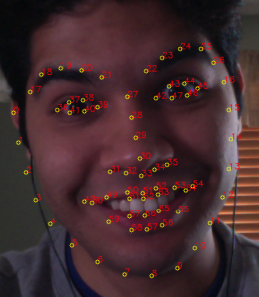
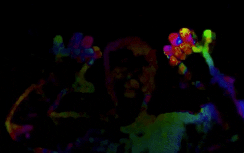
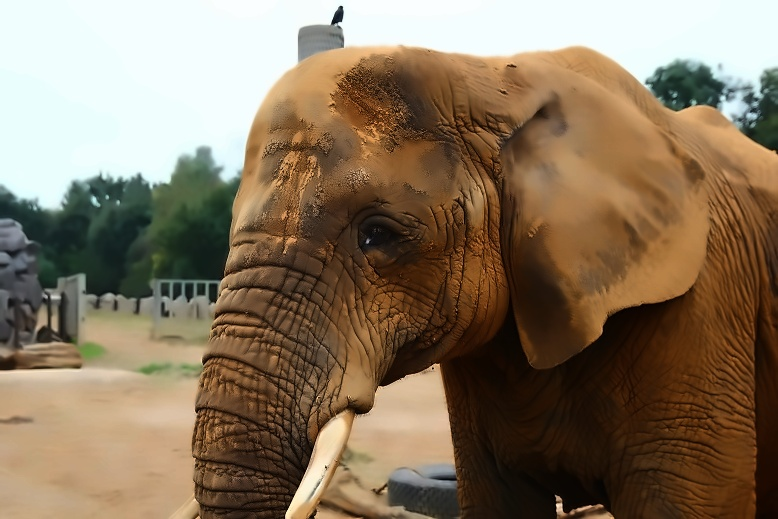
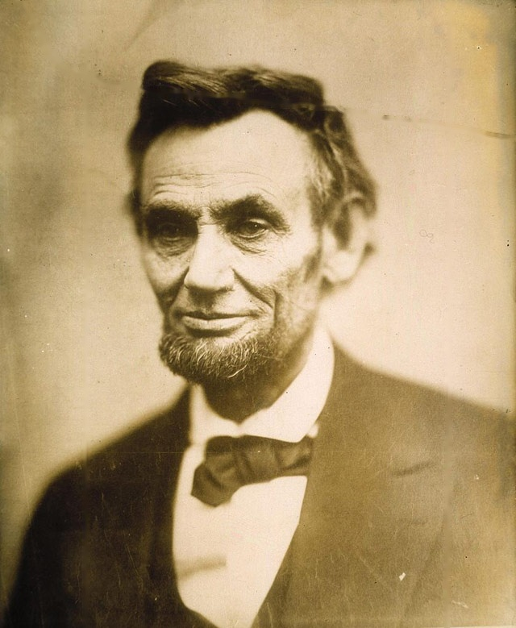
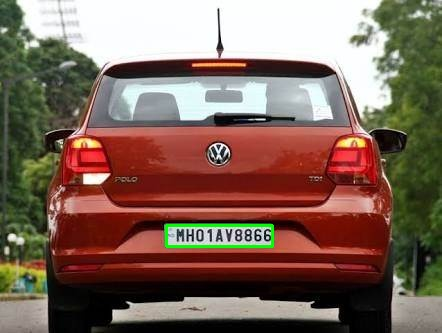

# OpenCV_Projects

This repository includes any projects that I have completed with research, projects, or online classes that I will refer to. My main focus is to study fields that cross over Machine Learning (Convolutionary Neural Network, Support Vector Machines, and Clustering of K-means), Computer Vision, and Data Science. 

# Contents:
1. [Basics of Computer Vision and OpenCV](#Basics-of-Computer-Vision-and-OpenCV)
2. [Image Manipulation and Processing](#Image-Manipulation-and-Processing)
3. [Image Segmentation and Contours](#Image-Segmentation-and-Contours)
4. [Object Detection Part 1: Intro](#Object-Detection-Part-1-Intro)
5. [Object Detection Part 2: Build a Face, people and Car Detectors](#Object-Detection-Part-2-Build-a-Face-people-and-Car-Detectors)
6. [Augmented Reality (AR): Facial Landmark Identification](#Augmented-Reality-AR-Facial-Landmark-Identification)
7. [Simple Machine Learning using OpenCV](#Simple-Machine-Learning-using-OpenCV)
8. [Object Tracking and Motion Analysis](#Object-Tracking-and-Motion-Analysis)
9. [Computational Photography](#Computational-Photography)
10. [Self Driving Cars](#Self-Driving-Cars)
11. [Deep Learning](#Deep-Learning)

# Sections: 
### Basics of Computer Vision and OpenCV 
### ([Return back to Contents](#Contents))
Image Processing. Learn some of the basics of image processing such as blurring an image, understanding image morphology, geometric transforms, and image histograms.
 

|                       |        |          |
| :---:                 | :----: |  :----:  |
| [OpenCV Intro](https://github.com/rchavezj/OpenCV_Projects/blob/master/Sec01_Basics_of_CV/01-Reading-Writing-and-displaying-images/01-Reading-Writing-and-displaying-images.ipynb)|        |  Learn how to display a simple image   plt.imshow(cv2.cvtColor(input, cv2.COLOR_BGR2RGB))|
| [Grayscaling](https://github.com/rchavezj/OpenCV_Projects/blob/master/Sec01_Basics_of_CV/02-Grayscaling/02-Grayscaling.ipynb) |  | Grayscaling is a very popular technique in computer vision to find the gradient on edge points of an image. |
| [Colors HSV-Hue](https://github.com/rchavezj/OpenCV_Projects/blob/master/Sec01_Basics_of_CV/03-Colors-HSV-Hue-Saturation-Value/03-Colors-HSV-Hue-Saturation-Value.ipynb)  |        |  are alternative representations of the RGB color model, designed in the 1970s by computer graphics researchers to more closely align with the way human vision perceives color-making attributes.|
| [Colors Gray-RGB](https://github.com/rchavezj/OpenCV_Projects/blob/master/Sec01_Basics_of_CV/04-Colors-Gray-RGB/04-Colors-Gray-RGB.ipynb) |        |  More options to know the pixel features behind a picture. |
| [Color Red-Green-Blue](https://github.com/rchavezj/OpenCV_Projects/blob/master/Sec01_Basics_of_CV/05-Colors-Red-Green-Blue/05-Colors-Red-Green-Blue.ipynb)          |        |   Computers can only understand three colors: red, green, and blue. This topic helps us tweek the color intensity       |
| [Histogram](https://github.com/rchavezj/OpenCV_Projects/blob/master/Sec01_Basics_of_CV/06-Histograms/06-Histograms.ipynb)             |        |   Histogram helps us understaqnd the distribution behind the colors of an image. This is important to know when you plan on compiling a machine learning algorithm with a balanced dataset|
| [Drawings of Shapes](https://github.com/rchavezj/OpenCV_Projects/blob/master/Sec01_Basics_of_CV/07-Drawing-Images/07-Drawing-Images.ipynb)    |   | If you ever need to have shapes to interact with the computer vision world like object detection, it's common to create digital shapes to represent them.  |

### Image Manipulation and Processing
### ([Return back to Contents](#Contents))
In this section we are going to see how we are going to manipulate the image using OpenCV. Here we will learn to apply the following function on an image using OpenCV: (1) Image Transformations – Affine and Non-Affine Transformation (2) Image Translations – Moving image up, down, left and right (3) Rotation of image – Spinning the image (4) Scaling, Resizing, and Interpolation (5) Image Pyramids – Another way of resizing (6) Cropping – Cutting out the image region you want (7) Arithmetic operations for Brightening and Darkening of images

|  |  |   |
| :---:                     | :----: |  :----:  |
| [Transformation](https://github.com/rchavezj/OpenCV_Projects/blob/master/Sec02_Image_Manipulations/00_Transformation/affine_nonAffine.png)            |        |   In this chapter we learn how to transform images for rotation, scaling, bitwise pixel manipulations and edge detection. Before sending a picture or frame into a computer vision model, we need to adjust the features (histogram) in order to change quality. |
| [Img Translation](https://github.com/rchavezj/OpenCV_Projects/blob/master/Sec02_Image_Manipulations/01_Translations/01_Translations.ipynb)           |        |  Img Translation will help you crop your picture to adjust the features within your input. For example if you needed to train an AI to detect a specific object, you would want to crop your main label and avoid pixels irrelevant to what your detecting. |
| [Rotations](https://github.com/rchavezj/OpenCV_Projects/blob/master/Sec02_Image_Manipulations/02_Rotations/02_Rotations.ipynb)                 |        |          |
| [Scaling](https://github.com/rchavezj/OpenCV_Projects/blob/master/Sec02_Image_Manipulations/03_Scaling_re-sizing_and_interpolations/03_Scaling_re-sizing_and_interpolations.ipynb)   |        |          |
| [Image Pyramids (Resize)](https://github.com/rchavezj/OpenCV_Projects/blob/master/Sec02_Image_Manipulations/04_Image_Pyramids/04_Image_Pyramids.ipynb)   |        |          |
| [Region of intrest (Crop)](https://github.com/rchavezj/OpenCV_Projects/blob/master/Sec02_Image_Manipulations/05_Cropping/05_Cropping.ipynb)  |        |          |
| [Bitwise Operations (Mask)](https://github.com/rchavezj/OpenCV_Projects/blob/master/Sec02_Image_Manipulations/07_Bitwise_Operations_and_Masking/07_Bitwise_Operations_and_Masking.ipynb) |        |          |
| [Convolutions & Blurring](https://github.com/rchavezj/OpenCV_Projects/blob/master/Sec02_Image_Manipulations/08_Convolutions_and_Blurring/08_Convolutions_and_Blurring.ipynb)  |        |          |
| [Sharpening](https://github.com/rchavezj/OpenCV_Projects/blob/master/Sec02_Image_Manipulations/09_Sharpening/09_Sharpening.ipynb)  |        |          |
| [Thresholding](https://github.com/rchavezj/OpenCV_Projects/blob/master/Sec02_Image_Manipulations/10_Thresholding_Binarization_%26_Adaptive_Thresholding/10_Thresholding_Binarization_%26_Adaptive_Thresholding.ipynb)  |       |          |
|  [Dilation & Erosion](https://github.com/rchavezj/OpenCV_Projects/blob/master/Sec02_Image_Manipulations/11_Dilation_Erosion_Opening_and_Closing/11_Dilation_Erosion_Opening_and_Closing.ipynb) |       |          |
|  [Edge Detection](https://github.com/rchavezj/OpenCV_Projects/blob/master/Sec02_Image_Manipulations/12_Edge_Detection_%26_Image_Gradients/12_Edge_Detection_%26_Image_Gradients.ipynb) |        |          |
|  [Perspective & Affine Transforms](https://github.com/rchavezj/OpenCV_Projects/blob/master/Sec02_Image_Manipulations/13_Perspective_%26_Affine_Transforms/13_Perspective_%26_Affine_Transforms.ipynb)  |        |          |
|  [Live Sketch Using Webcam](https://github.com/rchavezj/OpenCV_Projects/blob/master/Sec02_Image_Manipulations/14_Live_Sketch_Using_Webcam/14_Live_Sketch_Using_Webcam.ipynb)  |        |          |

### Image Segmentation and Contours 
### ([Return back to Contents](#Contents))
Segmenting Images and Obtaining Interesting Points. Apply different algorithms to cluster data, segment images, as well as find and match interesting points in an image.

|                             |        |          |
| :---:                       | :----: |  :----:  |
|  [Segmentation and Contours](https://github.com/rchavezj/OpenCV_Projects/blob/master/Sec03_Image_Segmentation/01_Understanding_Contours/01_Understanding_Contours.ipynb)  |        |          |
|  [Sorting Contours](https://github.com/rchavezj/OpenCV_Projects/blob/master/Sec03_Image_Segmentation/02_Sorting_Contours/02_Sorting_Contours.ipynb)           |        |          |
|  [Approx. Contours & Convex](https://github.com/rchavezj/OpenCV_Projects/blob/master/Sec03_Image_Segmentation/03_Approximating_Contours_and_Convex_Hull/03_Approximating_Contours_and_Convex_Hull.ipynb)    |        |          |
|  [Contours & Convex Live Stream](https://github.com/rchavezj/OpenCV_Projects/blob/master/Sec03_Image_Segmentation/03_Approximating_Contours_and_Convex_Hull/03_contours_convex_live_camera.ipynb)       |        |          |
|  [Matching Contour](https://github.com/rchavezj/OpenCV_Projects/blob/master/Sec03_Image_Segmentation/04_Matching_Contours_Shape/04_Matching_Contours_Shape.ipynb)            |        |          |
|  [Identify Contour](https://github.com/rchavezj/OpenCV_Projects/blob/master/Sec03_Image_Segmentation/05_Identifying_Contours_by_Shape/05_Identifying_Contours_by_Shape.ipynb)            |        |          |
|  [Line Detection](https://github.com/rchavezj/OpenCV_Projects/blob/master/Sec03_Image_Segmentation/06_Line_Detection_using_Hough_Lines/06_Line_Detection_using_Hough_Lines.ipynb)         |        |          |
|  [Circle Detection](https://github.com/rchavezj/OpenCV_Projects/blob/master/Sec03_Image_Segmentation/07_Circle_Detection_using_Hough_Cirlces/07_Circle_Detection_using_Hough_Cirlces.ipynb)           |        |          |
|  [Blob Detection (Flowers)](https://github.com/rchavezj/OpenCV_Projects/blob/master/Sec03_Image_Segmentation/08_Blob_Detection/08_Blob_Detection.ipynb)   |        |          |
|  [Counting Shapes](https://github.com/rchavezj/OpenCV_Projects/blob/master/Sec03_Image_Segmentation/09_Counting_Circle_and_Ellipses/09_Counting_Circle_and_Ellipses.ipynb)            |        |          |

### Object Detection Part 1: Intro
### ([Return back to Contents](#Contents))
|                    |        |          |
| :---:              | :----: |  :----:  |
|  [Feature Description](#)    |        |          |
|  [Finding Waldo](https://github.com/rchavezj/OpenCV_Projects/blob/master/Sec04_Object_Detection_01/01_Finding_Waldo/01_Finding_Waldo.ipynb)     |        |          |
|  [Finding Corners](https://github.com/rchavezj/OpenCV_Projects/blob/master/Sec04_Object_Detection_01/02_Finding_Corners/02_Finding_Corners.ipynb)    |        |          |
|  [Histogram of Oriented Gradients](https://github.com/rchavezj/OpenCV_Projects/blob/master/Sec04_Object_Detection_01/05_Histogram_of_Oriented_Gradients/05_Histogram_of_Oriented_Gradients.ipynb)    |         |       |

### Object Detection Part 2: Build a Face, people and Car Detectors
### ([Return back to Contents](#Contents))
|                                 |        |          |
| :---:                           | :----: |  :----:  |
| [HAAR Cascade Classifiers](https://github.com/rchavezj/OpenCV_Projects/blob/master/Sec05_Object_Detection_02/00_HAAR_Cascade/HAAR_01.png)        |        |          |
| [Face and Eye Detection](https://github.com/rchavezj/OpenCV_Projects/blob/master/Sec05_Object_Detection_02/01_Face_n_Eye_Detection/01_%20Face_%26_Eye_Detection.ipynb)          |        |          |
| [Car  Video Detection](https://github.com/rchavezj/OpenCV_Projects/blob/master/Sec05_Object_Detection_02/02_Car_Detection/02_Car_Detection.ipynb)            |        |          |
| [Pedestrian  Video Detection](https://github.com/rchavezj/OpenCV_Projects/blob/master/Sec05_Object_Detection_02/03_Pedestrian_Detection/03_Pedestrian_Detection.ipynb)     |        |          |

### Augmented Reality (AR): Facial Landmark Identification 
### ([Return back to Contents](#Contents))
Recognizing Objects. Detect different shapes, faces, people, and learn how to train a detector to detect custom objects and to recognize faces.

|                               |        |          |
| :---:                         | :----: |  :----:  |
|  [Face Analysis and Filtering](Sec06_Augmented_Reality/01_Facial_Landmarks/01_Facial_Landmarks.ipynb)  |        |          |
|  [Face Reader (Yawn Detector)](Sec06_Augmented_Reality/04_Yawn_Detector_and_Counting/04_Yawn_Detector_and_Counting.ipynb)  |        |          |
|  [Object Detector - AR   (Keras/TensorFlow)](https://github.com/rchavezj/OpenCV_Projects/blob/master/Sec06_Augmented_Reality/06/06_Augmented_Machine_Learning.ipynb)  |      |          |
 
### Simple Machine Learning using OpenCV 
### ([Return back to Contents](#Contents))
|                                  |        |          |
| :---:                            | :----: |  :----:  |
|  [Handwritten Digit Recognition](https://github.com/rchavezj/OpenCV_Projects/blob/master/Sec07_Simple_Machine_Learning/01_Digit_Classifier/train_digits.ipynb)   |        |          |
|  [Credit Card Reader](https://github.com/rchavezj/OpenCV_Projects/blob/master/Sec07_Simple_Machine_Learning/02_Credit_Card_Reader/03_Credit_Card_Reader.ipynb)              |        |          |
|  [Facial Recognition](https://github.com/rchavezj/OpenCV_Projects/blob/master/Sec07_Simple_Machine_Learning/02-Face-Recognition-%C3%B1-Unlock-Your-Computer-With-Your-Face!/02-Face-Recognition-%C3%B1-Unlock-Your-Computer-With-Your-Face!.ipynb)              |        |          |

### Object Tracking and Motion Analysis
### ([Return back to Contents](#Contents))
|                                     |        |          |
| :---:                               | :----: |  :----:  |
|  [HSV Filter](https://github.com/rchavezj/OpenCV_Projects/blob/master/Sec08_Object_Tracking/01_Filtering_By_Color/01_Filtering%20by%20Color.ipynb)                         |        |          |
|  [Background Subtraction](https://github.com/rchavezj/OpenCV_Projects/blob/master/Sec08_Object_Tracking/02_Background_Subtraction/02_Background_Subtraction.ipynb)             |        |          |
|  [Meanshift (Object Tracking)](https://github.com/rchavezj/OpenCV_Projects/blob/master/Sec08_Object_Tracking/03_Meanshift_Object_Tracking/03_Meanshift_Object_Tracking.ipynb)        |        |          |
|  [CAMshift (Object Tracking)](https://github.com/rchavezj/OpenCV_Projects/blob/master/Sec08_Object_Tracking/04_Camshift_Object_Tracking/04_Camshift_Object_Tracking.ipynb)         |        |          |
|  [Optical Flow](https://github.com/rchavezj/OpenCV_Projects/blob/master/Sec08_Object_Tracking/05_Optical_Flow/05_Optical%20Flow%20Object%20Tracking.ipynb)                       |        |          |
|  [Ball Tracking](https://github.com/rchavezj/OpenCV_Projects/blob/master/Sec08_Object_Tracking/06_Ball%20Tracking.ipynb)                      |        |          |

### Computational Photography
### ([Return back to Contents](#Contents))
Computational Photography. Create panoramas, remove unwanted objects from photos, enhance low light photographs, and work with High Dynamic Range (HDR) images. Calibration and Stereo Images. Learn how to calibrate cameras, remove distortion from images, change the 3D perspective of photographs, and work with stereo images to represent depth information.
 

|                             |        |          |
| :---:                       | :----: |  :----:  |
|  [Photo Denoising](https://github.com/rchavezj/OpenCV_Projects/blob/master/Sec09_Computer_Photography/01_Photo_Denoising/01_Photo_Denoising.ipynb)          |        |          |
|  [Photo Restoration](https://github.com/rchavezj/OpenCV_Projects/blob/master/Sec09_Computer_Photography/02_Photo_Restoration_using_inpainting/02_Photo_Restoration_using_inpainting.ipynb)          |        |          |
|  [Lisence Plate Recognition](https://github.com/rchavezj/OpenCV_Projects/blob/master/Sec09_Computer_Photography/03_Automatic_Number_Plate_Recognition/03_Automatic_Number_Plate_Recognition.ipynb)  |        |          |

### Self Driving Cars 
### ([Return back to Contents](#Contents))
|                       |        |          |
| :---:                 | :----: |  :----:  |
| [Finding Lanes](https://github.com/rchavezj/OpenCV_Projects/tree/master/Sec10_Self_Driving_Cars)    |        |          |

### Deep Learning 
### ([Return back to Contents](#Contents))
|                       |        |          |
| :---:                 | :----: |  :----:  |
| [Neural Style Transfer (Image)](https://github.com/rchavezj/OpenCV_Projects/blob/master/Sec11_Deep_Learning/01_Neural_Style_Transfer/01_Neural_Style_Transfer_Image.ipynb)     [Neural Style Transfer (Video Stream)](https://github.com/rchavezj/OpenCV_Projects/blob/master/Sec11_Deep_Learning/01_Neural_Style_Transfer/01_Neural_Style_Transfer_Vid_Stream.ipynb)  |        |   Generate a new image/frame from transferring the style of another source that was optimized. The content from the input remains intact for the output.|
| [Mask_RCNN (Keras/TensorFlow)](https://github.com/rchavezj/OpenCV_Projects/blob/master/Sec11_Deep_Learning/02_MaskRCNN/process_video.py)  |        |           |

